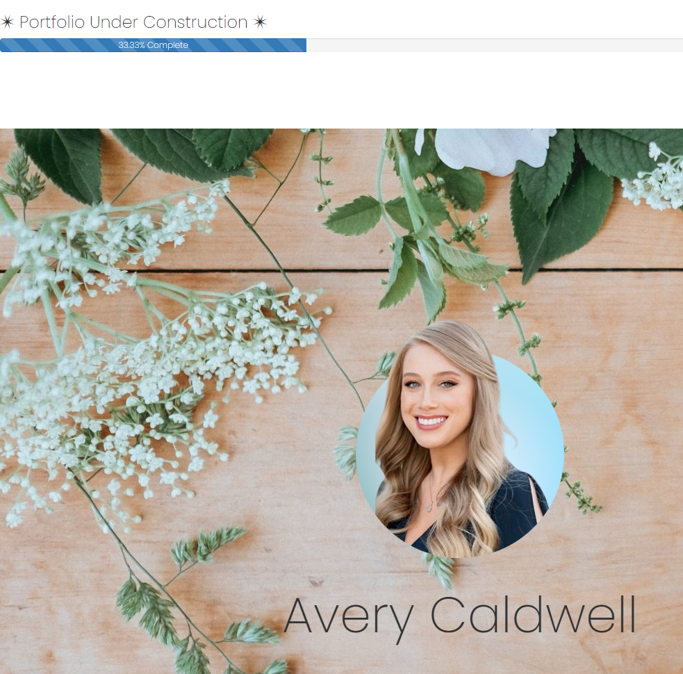

# 💼 My Portfolio 

 

## Table of contents
- [Description](#description)
- [Overview](#overview)
  - [User experience](#user-experience)
  - [Screenshot](#screenshot)
  - [Links](#links)
- [My process](#my-process)
  - [Built with](#built-with)
  - [Useful resources](#useful-resources)
- [Author](#author)

 
 

# 📝 Description

- A portfolio consisting of education, training, skills and experiences that provides insight into my personality and work ethic. 

 

# 📁 Overview

### 👤 User Experience
1. Once the coverpage has loaded, then click the "Show More" button to view the portfolio.
2. Scroll to see listed projects
3. Click on the project image to be taken to the live page of the application or Github repository
4. Navigation links will be available for further contact and social media links

 

### 📷 Screenshot 
​

​
​ 

### 🔗 Links 
- Live URL: [https://averycaldwell.github.io/My-Portfolio/](https://drive.google.https://averycaldwell.github.io/My-Portfolio/)

 

 

## 💡 My process 

### 🔨 Built with 

- HTML
- CSS
- Bootstrap
- JavaScript

 

### 📚 Useful resources

- Emojis: [https://github.com/ikatyang/emoji-cheat-sheet#office](https://github.com/ikatyang/emoji-cheat-sheet#office)
​

 

 

## Author ✏️
  Avery Caldwell
  - Email: [AveryCaldwell7@gmail.com](AveryCaldwell7@gmail.com)
  - LinkedIn: [https://www.linkedin.com/in/averycaldwell/](https://www.linkedin.com/in/averycaldwell/)
  - GitHub: [AveryCaldwell](https://github.com/AveryCaldwell)
